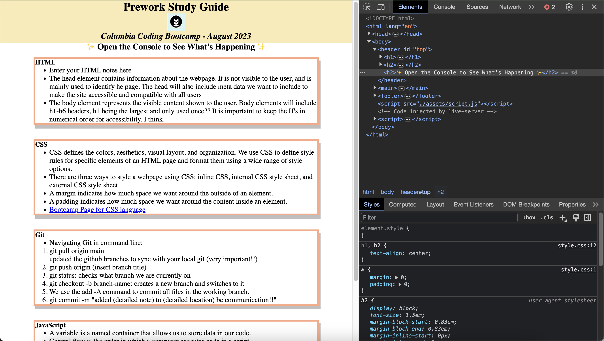

# Pre-Work-Study-Guide
## A study guide for the pre-work werk

This project was to document the experience of Pre-Work at Columbia bootcamp. Not only did we detail the sections of the class with specific notes, we utilized our learned skills to complete the project itself. This project can act as a reference guide as we move futher into our studies, and will be regularly updated to reflect our learned items. 

The site details our notes for the following topics: 
HTML 
CSS
JavaScript
and the use of Git Hub to assist in the workflow

## Installation

In order to get the full experience, users must open "inspect" to view the JavaScript functions. The JS will generate one of the 4 topics at random to study. Once a topic is chosen, dive in! 

## Usage

Right click any part of the webpage to bring up the "inspect" optin in ChromeDev. Once found, your browser should look like the following screenshot:

## Credits

The collaborators on this project include me, myself, and Taylor
@tayskully 
 third-party assets
 Tutorials followed include Columbia University EdX's Coding Bootcamp 2023, as well as: 
 [Github Docs](https://docs.github.com/en)
 [developer mozilla](https://developer.mozilla.org/en-US/)
 [Dev.to](https://dev.to/)
 [Code Academy blogs](https://www.codecademy.com/resources/blog/)

## License

Licensed under the [MIT](LICENSE) license

Please refer to the LICENSE in the repo.

---

🏆 The previous sections are the bare minimum, and your project will ultimately determine the content of this document. You might also want to consider adding the following sections.

## Badges

